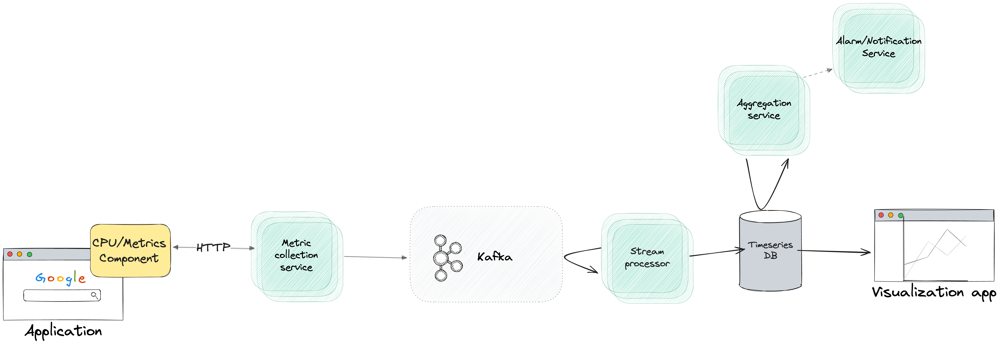

# Hive take-home assignment

The monorepo contains multiple repositotories:

* api - express server with minimal implementation
* shared types - typescript types
* tauri cpu - main app using Angular for frontend and Tauri as a construction toolkit to build the app on Desktop

## System design

Potential increase of scope to collect more metrics using such system design
